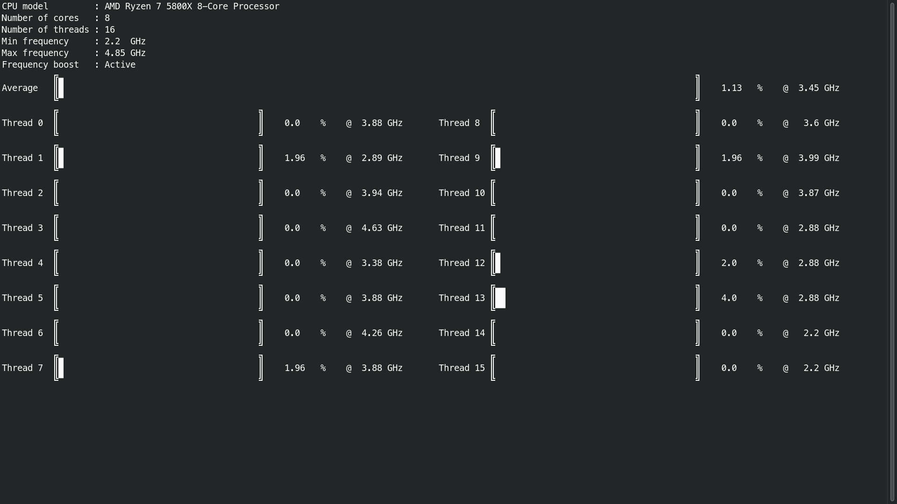

# cpustat
Shows relevant info about the processor
- model name
- number of cores
- number of threads
- minimum frequency
- maximum frequency
- boost frequency status (if available)
- average usage @ average current frequency
- usage @ current frequency for each thread



# Installation
Doesn't require any additional package

To run it outside the repository's directory, copy the executable in "/usr/local/bin" 

```commandline
sudo cp ./cpustat /usr/local/bin
```